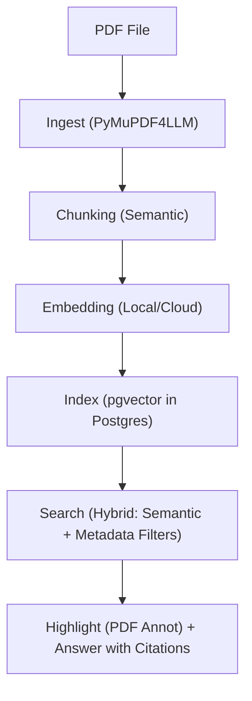

# 🪶 QueryNest

**QueryNest** is a local-first, AI-powered document search engine that lets users find information inside their personal PDFs using natural language — with precise in-document highlights.

Instead of searching by file name, QueryNest understands the *meaning* of your documents. Search for "operating system concepts" and find every paper that discusses operating systems — even if those exact words never appear. Filter by year, exam type, or subject, and jump straight to the highlighted passage.

---

## ✨ Key Features

| Feature | Description |
|---|---|
| 🔍 **Hybrid Search** | Combines semantic (vector) search with metadata filters — year range ("2020–2024"), recency ("last 3 years"), subject, or exam type — in a single query, e.g. *"QP of [subject], last 3 years"* resolves to a subject + year-range filter plus a semantic match, not semantic search alone. |
| 🖍️ **In-Document Highlighting + Citations** | Relevant passages are highlighted directly in the PDF, and generated answers include citations back to the specific chunk/page they came from. |
| 🔒 **Privacy-First** | Choose between fully local processing (embeddings + storage on your device) or optional cloud compute. |
| 📱 **Cross-Platform** | Android, iOS, Web, and Desktop clients — all powered by the same core engine. |

---

## 🏗️ Architecture

QueryNest follows a modular **monorepo** structure with a shared Python core and platform-specific frontends:

```
QueryNest-New/
├── core/                    # Shared Python engine (the brain)
│   ├── ingest/              # PDF loading, text extraction, normalization, cleanup
│   ├── chunking/            # Semantic chunking with heading detection
│   ├── embedding/           # Vector embedding generation (local & cloud)
│   ├── index/               # Vector storage (pgvector, in Postgres)
│   ├── search/              # Hybrid search: semantic + metadata filtering
│   ├── storage/             # Document & chunk metadata persistence (Postgres)
│   ├── models/              # Shared data models (TextBlock, Chunk, etc.)
│   ├── config.py            # Global configuration
│   └── main.py              # CLI entry point
├── apps/                    # Platform-specific frontends
│   ├── web/                 # Web app (React / Next.js)
│   ├── mobile/              # Mobile app (React Native / Flutter)
│   └── desktop/             # Desktop app (Electron / Tauri)
├── packages/                # Shared frontend utilities
├── scripts/                 # Dev & deployment scripts
├── tests/                   # Test suite + evaluation harness
│   ├── fixtures/            # Sample PDFs for testing
│   └── ingest/              # Ingest module tests
└── requirements.txt         # Python dependencies
```

> **Note:** `core/index/` and `core/storage/` above describe the target design (pgvector in Postgres). The current code still uses a standalone FAISS index — see [Current Status](#-current-status).

### Core Pipeline



## 📦 Current Status

### ✅ Completed — Ingest & Chunking Pipeline

| Module | File | Status |
|---|---|---|
| **PDF Loader** | `core/ingest/loader.py` | ✅ Done |
| **Text Extractor** | `core/ingest/extractor.py` | ✅ Done |
| **Span → Line Normalizer** | `core/ingest/normalizer.py` | ✅ Done |
| **Line → Paragraph Normalizer** | `core/ingest/normalizer.py` | ✅ Done |
| **Header/Footer Cleanup** | `core/ingest/cleanup.py` | ✅ Done |
| **Heading Detection** | `core/chunking/heading.py` | ✅ Done |
| **Token Estimation** | `core/chunking/tokenizer.py` | ✅ Done |
| **Semantic Chunker** | `core/chunking/chunker.py` | ✅ Done |
| **TextBlock Model** | `core/models/text_block.py` | ✅ Done |
| **Chunk Model** | `core/models/chunk.py` | ✅ Done |

Note: the ingest pipeline above currently uses raw **PyMuPDF**; migrating it to **PyMuPDF4LLM** is planned but not started — nothing in `core/ingest/` has changed yet, and the migration will likely simplify some of the normalization/heading heuristics.

### 🔲 Upcoming — Core Engine

| Module | Status |
|---|---|
| Embedding generation (local, via `fastembed`) | ✅ Done |
| Vector indexing (FAISS, standalone) | ✅ Done — being replaced by pgvector |
| Migrate ingest to PyMuPDF4LLM | 🔲 Planned |
| Vector storage via **pgvector** (Postgres) | 🔲 Planned |
| Hybrid search (semantic + metadata filtering) | 🔲 Planned |
| Document metadata extraction (year, subject, type) | 🔲 Planned |
| PDF highlight annotation | 🔲 Planned |
| Answer generation with citations | 🔲 Planned |
| Storage layer (Postgres) | 🔲 Planned |
| Evaluation harness (retrieval/answer quality metrics) | 🔲 Planned |
| REST API server | 🔲 Planned |

---

## 🚀 Getting Started

### Prerequisites

- Python 3.10+
- pip

### Installation

```bash
# Clone the repository
git clone https://github.com/Apoorv012/QueryNest-New.git
cd QueryNest-New

# Create virtual environment
python -m venv .venv

# Activate it
# Windows:
.venv\Scripts\activate
# macOS/Linux:
source .venv/bin/activate

# Install dependencies
pip install -r requirements.txt
```

### Running

```bash
# Run the main pipeline (ingest + chunk a sample PDF)
python -m core.main
```

---

## 🧪 Testing

Tests are written with **pytest** and live in the `tests/` directory. The test suite uses the "Attention Is All You Need" paper (`tests/fixtures/sample.pdf`) as a fixture.

```bash
# Run all tests
pytest

# Run with verbose output
pytest -v

# Run a specific test file
pytest tests/ingest/test_extractor.py
```

Beyond unit tests, an evaluation harness is planned to measure retrieval and answer quality (e.g. precision/recall on a fixed query set, citation accuracy) and track those metrics over time — so a change's impact on real search quality is measurable, not just whether tests pass.

---

## 🛡️ Privacy Philosophy

QueryNest is built **local-first**. By default:
- All PDF processing happens on your device
- Embeddings are generated locally using open-source models
- No data leaves your machine

For users who want faster processing, an **optional cloud mode** is available — with data encrypted in transit and at rest.

---

## 📄 License

This project is under active development. License TBD.

---

## 🤝 Contributing

Contributions welcome! Please open an issue first to discuss what you'd like to change.