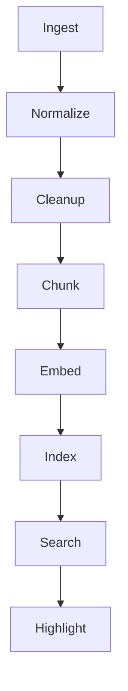

# QueryNest — Architecture Guide

This document describes the internal architecture of QueryNest's core engine. It is intended for contributors and anyone who wants to understand how the system works under the hood.

---

## Overview

QueryNest's core is a **pipeline architecture** that transforms raw PDF bytes into searchable, semantically indexed chunks. The pipeline has six stages:



Each stage is a standalone module with clear inputs/outputs and no circular dependencies.

---

## Data Models

### `TextBlock` (`core/models/text_block.py`)

The atomic unit of extracted text. Every span of text from a PDF becomes a `TextBlock`.

| Field | Type | Description |
|---|---|---|
| `text` | `str` | The extracted text content |
| `page` | `int` | Zero-indexed page number |
| `bbox` | `Tuple[float, float, float, float]` | Bounding box `(x0, y0, x1, y1)` in PDF coordinates |
| `page_height` | `float` | Height of the source page (used for header/footer detection) |

**Design note**: `page_height` is stored per-block rather than looked up later, because it's readily available during extraction and eliminates a cross-reference later.

### `Chunk` (`core/models/chunk.py`)

A semantically coherent unit of text, ready for embedding.

| Field | Type | Description |
|---|---|---|
| `text` | `str` | Joined paragraph text (newline-separated) |
| `pages` | `List[int]` | Sorted list of pages this chunk spans |
| `bboxes` | `List[Tuple]` | One bbox per source paragraph |

**Design note**: Chunks track multiple bboxes (one per paragraph) rather than a single merged bbox. This allows precise highlighting of each paragraph independently.

### `Document` (Planned — `core/models/document.py`)

Top-level metadata for an ingested PDF.

| Field | Type | Description |
|---|---|---|
| `id` | `str` | UUID |
| `filename` | `str` | Original filename |
| `title` | `str` | Extracted or inferred title |
| `year` | `int \| None` | Publication/exam year |
| `subject` | `str \| None` | Inferred subject |
| `doc_type` | `str \| None` | E.g., "question_paper", "notes", "research_paper" |
| `num_pages` | `int` | Total pages |
| `ingested_at` | `datetime` | Timestamp |

### `SearchResult` (Planned — `core/models/search_result.py`)

Returned by the search engine.

| Field | Type | Description |
|---|---|---|
| `document` | `Document` | Parent document |
| `chunk` | `Chunk` | Matching chunk |
| `score` | `float` | Similarity score (0.0–1.0) |
| `highlights` | `List[Tuple]` | Bboxes to highlight in the PDF |

---

## Module Details

### 1. Ingest (`core/ingest/`)

**Purpose**: Load a PDF and extract structured text with positional metadata.

#### `loader.py`
- Uses **PyMuPDF** (`pymupdf`) to open PDF files.
- Validates `.pdf` extension.
- Returns a `pymupdf.Document` handle.

#### `extractor.py`
- Iterates over every page → block → line → span.
- Skips non-text blocks (`type != 0`).
- Strips whitespace, skips empty spans.
- Produces `List[TextBlock]` — one per span.

#### `normalizer.py`
Two-pass normalization:

1. **`merge_spans_to_lines`**: Merges spans on the same line (within `LINE_Y_TOLERANCE = 2.5` pts). This reconstructs full lines from fragmented PDF spans.

2. **`merge_lines_to_paragraphs`**: Merges consecutive lines into paragraphs when the vertical gap is less than `PARA_GAP = 10.0` pts. Page breaks always start a new paragraph.

#### `cleanup.py`
Removes noise from the extracted paragraphs:

- **Repeated headers/footers**: Text appearing on ≥ 3 pages (`MIN_PAGE_REPEATS`) in the top 10% or bottom 10% of the page.
- **Page numbers**: Numeric-only text at page edges (e.g., "42", "Page 7").
- **Junk paragraphs**: Very short non-alphabetic strings (≤ 10 chars with no letters).
- **Non-language content**: Blocks without any word ≥ 3 letters.

### 2. Chunking (`core/chunking/`)

**Purpose**: Split cleaned paragraphs into chunks sized for embedding models.

#### `chunker.py`
Greedy chunking with two split triggers:

1. **Heading boundary**: When a heading is detected and the current chunk has ≥ `MIN_TOKENS` (120), flush the chunk.
2. **Token overflow**: When adding a paragraph would exceed `MAX_TOKENS` (400), flush the current chunk.

Token limits are tuned for typical embedding models (384–512 token context windows).

#### `heading.py`
Heuristic heading detection:

- Numbered headings: `1.2.3 Title` or `IV. Title`
- Roman numeral headings: `I. Introduction`
- ALL CAPS short headings (≤ 5 words)
- Length cap: text > 40 chars is assumed to be body text.

#### `tokenizer.py`
Rough token estimation: `word_count × 1.3`. Good enough for chunking decisions; actual tokenization happens at the embedding stage.

### 3. Embedding (`core/embedding/`) — Planned

**Purpose**: Convert chunk text into dense vector representations.

- **Local mode**: `sentence-transformers` with `all-MiniLM-L6-v2` (384-dim, ~80MB).
- **Cloud mode**: Optional API-based embeddings (OpenAI, Cohere, etc.).
- Interface: `embed(texts: List[str]) → np.ndarray` of shape `(n, dim)`.

### 4. Index (`core/index/`) — Planned

**Purpose**: Store and search vectors efficiently.

- **FAISS** (`IndexFlatIP` for small collections, `IndexIVFFlat` for large ones).
- Maps vector indices back to `(document_id, chunk_index)` pairs.
- Supports incremental addition (no full rebuild on new uploads).

### 5. Search (`core/search/`) — Planned

**Purpose**: Semantic search with metadata filtering.

- Embed the query → search the FAISS index → retrieve top-K chunks.
- **Post-filter** by metadata: year range, subject, document type.
- **Smart query parsing**: Extract structured filters from natural language (e.g., "OS papers from 2020 to 2024" → `subject=OS, year_min=2020, year_max=2024`).

### 6. Storage (`core/storage/`) — Planned

**Purpose**: Persist document metadata and chunk data.

- **SQLite** for document metadata (lightweight, zero-config, local-first).
- **FAISS index files** for vectors (binary serialization).
- Future: Optional cloud sync with encryption.

---

## Configuration (`core/config.py`)

Planned configuration structure:

```python
@dataclass
class QueryNestConfig:
    # Embedding
    embedding_model: str = "all-MiniLM-L6-v2"
    embedding_dim: int = 384
    use_cloud_embedding: bool = False

    # Chunking
    max_chunk_tokens: int = 400
    min_chunk_tokens: int = 120

    # Search
    top_k: int = 10

    # Storage
    db_path: str = "~/.querynest/querynest.db"
    index_path: str = "~/.querynest/index.faiss"

    # Highlighting
    highlight_color: Tuple[float, float, float] = (1.0, 1.0, 0.0)  # Yellow
```

---

## Cross-Cutting Concerns

### Error Handling
- `ValueError` for invalid inputs (wrong file type, empty queries).
- `RuntimeError` for infrastructure failures (PDF load failure, model download failure).
- All errors include descriptive messages for debugging.

### Testing Strategy
- Tests use `pytest` with a real PDF fixture (`tests/fixtures/sample.pdf` — "Attention Is All You Need").
- Integration tests run the full pipeline; unit tests mock dependencies.
- Run with: `pytest` (uses `pythonpath = .` from `pytest.ini`).

### Performance Considerations
- Embedding is the bottleneck (~100ms per chunk on CPU). Batching is critical.
- FAISS `IndexFlatIP` is exact but O(n). Switch to `IndexIVFFlat` for > 10K chunks.
- PyMuPDF is fast (~50ms per page). No optimization needed there.
